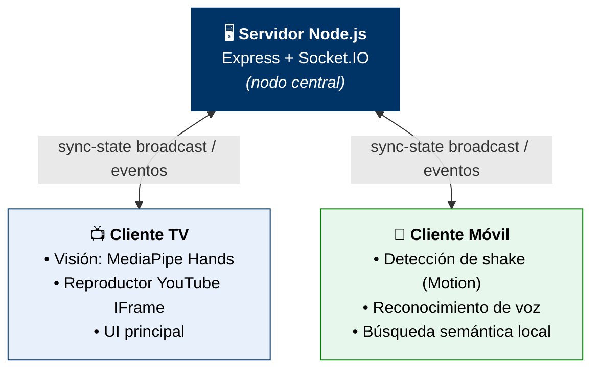

<div align="center">

# 🎤 Karaoke Ubicuo

### Canta, baila y controla la fiesta... sin soltar el micrófono

*Sistema distribuido y multimodal para controlar el karaoke de casa 100% manos libres.*

<br>


<br>

[💡 Problema](#-motivación-y-problema) ·
[🛠️ Interacciones](#️-interacciones-multimodales) ·
[🏗️ Arquitectura](#️-arquitectura-del-sistema) ·
[🚀 Instalación](#-instalación-y-despliegue) ·
[📊 Resultados](#-evaluación-y-resultados)

</div>

---

## 📖 ¿Qué es Karaoke Ubicuo?

**Karaoke Ubicuo** es un sistema distribuido y multimodal diseñado para **eliminar las interrupciones físicas** durante las reuniones de karaoke en casa.

Combina **visión por computador**, **detección de movimiento en dispositivos móviles**, **reconocimiento de voz** y **búsqueda semántica con IA local** para permitir un control **100 % manos libres y a distancia**.

> 🎯 **Objetivo:** que nadie tenga que levantarse del sofá, soltar su bebida o abandonar el micrófono para cambiar de canción.

---


## 👥 Autores y equipo

| | Integrante |
|:-:|:--|
| 👤 | **Iván González Portero** |
| 👤 | **Vanesa Elena Ionescu** |
| 👤 | **Jaime Sánchez Sánchez** |

| | |
|:--|:--|
| 📚 **Asignatura** | Sistemas Interactivos y Ubicuos |
| 🏫 **Universidad** | Universidad Carlos III de Madrid (UC3M) |
| 🧑‍🤝‍🧑 **Equipo** | Equipo 5 |
| 📅 **Curso académico** | 2024–2025 |

---

## 💡 Motivación y problema

En una fiesta de karaoke doméstica, la inmersión y la energía social se rompen constantemente cuando hay que **cambiar de canción, ajustar el volumen o pausar la música**. Esto obliga al usuario a soltar su bebida o micrófono, abandonar el grupo y desplazarse hasta el ordenador para usar el teclado o el ratón, a menudo a oscuras.

**Karaoke Ubicuo resuelve los 4 pain points principales identificados:**

| | Problema | Descripción |
|:-:|:--|:--|
| 🚫 | **Restricción física** | Manos ocupadas con bebidas o el micrófono. |
| ⏳ | **Ineficiencia** | Tiempo perdido en desplazamientos innecesarios. |
| 🧍 | **Aislamiento** | Separación física del cantante respecto al grupo. |
| 📉 | **Atmósfera rota** | Pérdida del clímax y de la energía social. |

---

## 🛠️ Interacciones multimodales

El control se reparte entre la **pantalla principal** (TV con webcam) y un **mando móvil inteligente** al que se accede directamente desde el navegador, sin instalar nada.

| # | Interacción | Tipo | Tecnología | Función |
|:-:|:--|:--|:--|:--|
| 1 | 🛑 **Palma abierta** | Gesto visual | Webcam + MediaPipe Hands | Pausar / parar reproducción |
| 2 | ✅ **OK** (pulgar + índice) | Gesto visual | Webcam + MediaPipe Hands | Reanudar reproducción |
| 3 | ❌ **Muñecas cruzadas (X)** | Gesto visual | Webcam + MediaPipe Hands | Acción destructiva / salir |
| 4 | 👍 **Pulgar arriba** | Gesto visual | Webcam + MediaPipe Hands | Reiniciar canción actual |
| 5 | 📱 **Agitar el móvil** (*shake*) | Sensor móvil | DeviceMotion API | Saltar a la siguiente canción |
| 6 | 🎙️ **Comandos de voz** | Voz | Web Speech API | Control e inserción por voz (*push-to-talk* y modo continuo) |
| 7 | 🔍 **Búsqueda semántica** | IA en cliente | Transformers.js (`all-MiniLM-L6-v2`) | Buscar por concepto o estado de ánimo (ej. *"pon algo bailable"*) |

---

## 🏗️ Arquitectura del sistema

El proyecto sigue una **arquitectura centralizada dirigida por eventos** (*Event-Driven Architecture*) que mantiene la **cola y el estado de reproducción sincronizados en tiempo real** entre todos los dispositivos conectados.



### 🧰 Stack tecnológico

| Capa | Tecnologías |
|:--|:--|
| ⚙️ **Backend** | Node.js · Express · Socket.IO |
| 📺 **Cliente TV / Visión** | MediaPipe Hands (21 landmarks de mano) · YouTube IFrame Player API |
| 📱 **Cliente móvil** | DeviceMotion API · Web Speech API |
| 🧠 **Lenguaje / IA** | Transformers.js con el modelo `all-MiniLM-L6-v2` |

<details>
<summary><b>🔬 Detalles técnicos</b> (clic para desplegar)</summary>

<br>

- **Detección de *shake*:** filtro de **3 picos > 25 m/s²** dentro de una **ventana de 800 ms**, para evitar falsos positivos con movimientos normales del móvil.
- **Gestos de mano:** MediaPipe Hands extrae **21 landmarks** por mano y a partir de ellos se clasifica cada gesto.
- **Búsqueda semántica:** el modelo `all-MiniLM-L6-v2` se ejecuta **directamente en el navegador** y calcula **similitud coseno** entre la consulta y el catálogo, **sin APIs de pago ni conexión a la nube**.

</details>

---

## 🚀 Instalación y despliegue

### Requisitos previos

- 🟢 **Node.js** v16.x o superior y **npm**.
- 📶 Dispositivos (TV/PC y móvil) conectados a la **misma red WiFi local**.
- 🌐 Navegador moderno con soporte para **Web Speech API** y **DeviceMotion** (ej. Chrome, Safari).

### Pasos

**1️⃣ Clonar el repositorio**

```bash
git clone https://github.com/usuario/karaoke-ubicuo.git
cd karaoke-ubicuo
```

**2️⃣ Instalar dependencias**

```bash
npm install
```

**3️⃣ Iniciar el servidor**

```bash
npm start
```

**4️⃣ Conectar los dispositivos**

| Dispositivo | Cómo acceder |
|:--|:--|
| 📺 **TV / PC principal** | Abre `http://localhost:3000` (o la IP local del servidor) en el navegador. |
| 📱 **Móvil** | Escanea el **código QR** que aparece en pantalla o entra en `http://<IP-LOCAL-SERVIDOR>:3000/mobile`. |

> 💡 **Consejo:** si el móvil no conecta, comprueba que ambos dispositivos están en la misma red y que el firewall del equipo permite conexiones al puerto `3000`.

---

## 📊 Evaluación y resultados

El sistema se validó con un **estudio con usuarios en entornos reales de prueba**, aplicando elicitación formativa *pre-test*, cuestionarios **SUS** (*System Usability Scale*) y dinámicas **I Like / I Wish / What If**.

<div align="center">

| 🏆 Puntuación SUS media | ✅ Tareas con 100 % de éxito | 🚶 Desplazamiento físico |
|:-:|:-:|:-:|
| **82.1 / 100**<br>*Excelente* | **6 de 7** | **0 %** |

</div>

- **Efectividad:** 6 de las 7 tareas evaluadas obtuvieron una tasa de éxito del 100 %.
- **Desplazamiento físico:** ningún participante necesitó acercarse a la pantalla ni abandonar su posición durante las pruebas.

---

## 📄 Licencia

Este proyecto se distribuye con fines académicos bajo la **[Licencia MIT](LICENSE)**.

<div align="center">

<br>

**Hecho con ❤️ y mucho karaoke en la UC3M** 🎶

</div>
